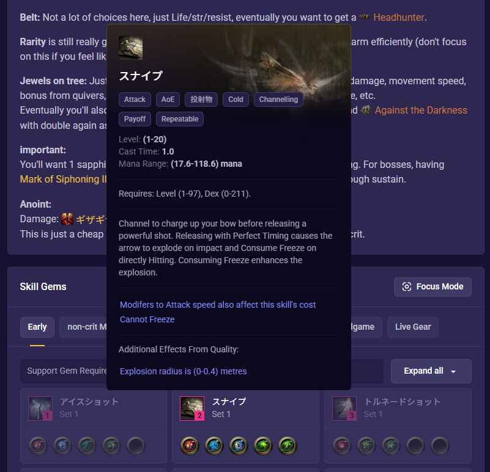
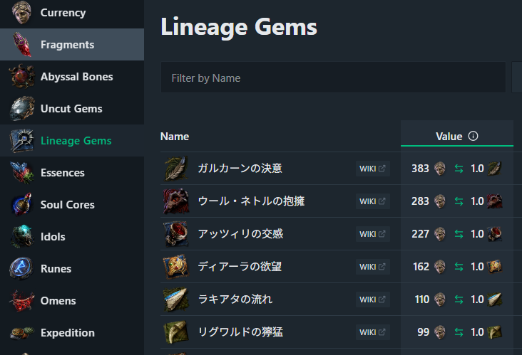
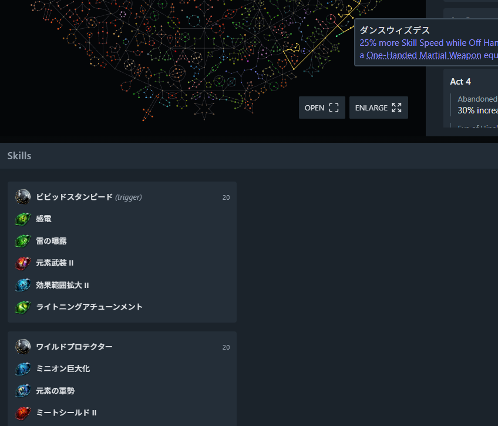

# 対応状況
- PoE2 バージョン： 0.5.2

# PoE2-Jp-Translator-Bookmarklet
- PoE2 Jp-Translator Bookmarklet: A lightweight browser tool that instantly replaces English PoE2 terms with Japanese translations on any web page.
- このブックマークレットはPoE2向けの英語Webサイトのスキルジェムやパッシブスキルを単語単位で日本語化するブックマークレットです。

# 使用イメージ

# 使用方法
- ※詳細は後で書く （bookmarklet.jsをブックマークに保存する。）
1. ブックマークを右クリック
2. ページを追加...
3. 名前は適当にJpTran等
4. 以下をスクリプトをURLに貼付して保存
- [JavaScript](https://github.com/ReHideAway/PoE2-Jp-Translator-Bookmarklet/blob/main/bookmarklet.js)
- かなり長いですが、そのまま貼り付けてください。
6. 単語変換したいWebページで先ほど作ったブックマークを押す

# 注意点
- 辞書が変更されてもブラウザのキャッシュの影響ですぐに更新されない可能性があります。
- 同じ英語で違う和訳がある場合（SkillgemとPassiveで同じ単語など）、/（スラッシュ）区切りで2個表示されます。
- 例：Whirling Assalt → ワーリングアサルト/旋風攻撃
- 
# 動作原理
- 複数の辞書があり、それらを呼んでJavaScriptにて書き換えています。
- [index.json](https://gist.github.com/ReHideAway/5b5d0b6d6db335003ef83514cbdfe373) に辞書一覧が登録されています。
- 各辞書の内容はindex.jsonから辿れば見れます。

# 辞書の変更方法
- ※詳細は後で書く
- 特定の辞書のみにしたり、自作辞書を追加など
- github gistでindex.jsonで読み込む辞書を登録しているので、自分で準備すれば変更可能

# 対応状況・更新
- 2026/06/17 - Support Gem に対応
- 2026/06/16 - Active Skill に対応
- 2026/06/16 - Passive Skill に対応
